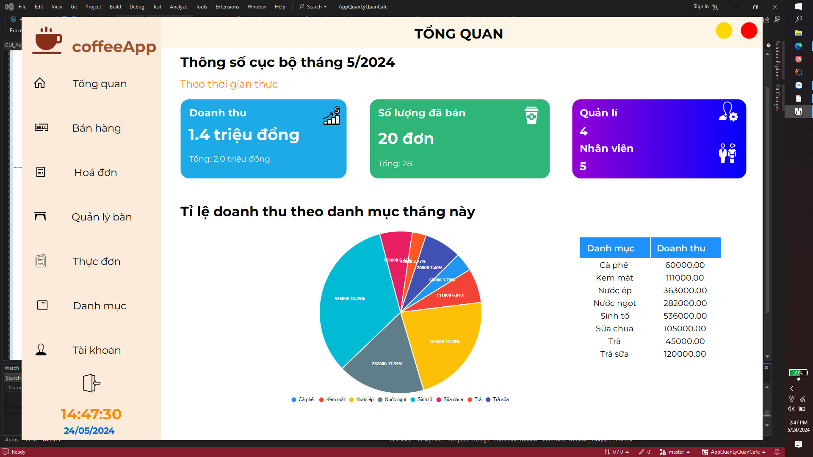

# Quản Lý Quán Cà Phê

## Giới thiệu

Đây là tiểu luận môn lập trình trên Windows, được thực hiện bởi **Trần Ngọc Minh**. Ứng dụng này là một hệ thống đơn giản nhằm quản lý cho quán cà phê, được tham khảo từ nhiều nguồn. Được thực hiện bởi sinh viên năm 2 nên còn nhiều nghiệp dư, đầy sơ sài và sai sót.

## Tính năng

- Đăng nhập với tài khoản mặc định:
  - Tài khoản: `admin`
  - Mật khẩu: `0`
  - Mật khẩu được mã hoá dưới database để bảo mật thông tin.

- Hiển thị chuẩn và đầy đủ nhất ở scale 100% của Windows.

- Thiết kế theo mô hình 3 lớp.

## Công nghệ

- **Guna UI Extension**: Sử dụng để tạo giao diện người dùng trực quan và hiện đại.
- **LiveChart Extension**: Sử dụng để hiển thị biểu đồ và đồ thị trực quan.
- **RDLC Designer**: Sử dụng để tạo và thiết kế báo cáo (ứng dụng cho việc tạo hoá đơn bán hàng).
- **ADO.NET**: Sử dụng để làm việc với cơ sở dữ liệu và xử lý dữ liệu.

## Yêu Cầu Hệ Thống

- Hệ điều hành: Windows.
- Hiển thị tốt nhất ở scale 100% của Windows.

## Cài Đặt

1. Clone repository về máy tính của bạn.
2. Mở project bằng trình biên dịch phù hợp.
3. Cấu hình cơ sở dữ liệu.
4. Chạy ứng dụng.

## Hỗ Trợ

Liên hệ Trần Ngọc Minh qua email: tnminhgl.contact@gmail.com để nếu có bất cứ thắc mắc nào.

## Bản Quyền

© 2024 Trần Ngọc Minh.

## Đóng Góp

Mọi đóng góp vào dự án đều được hoan nghênh. 
